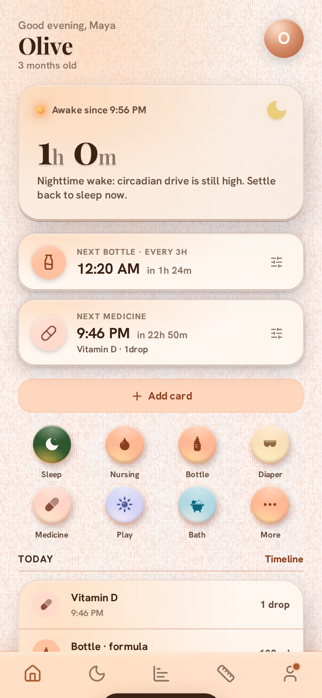
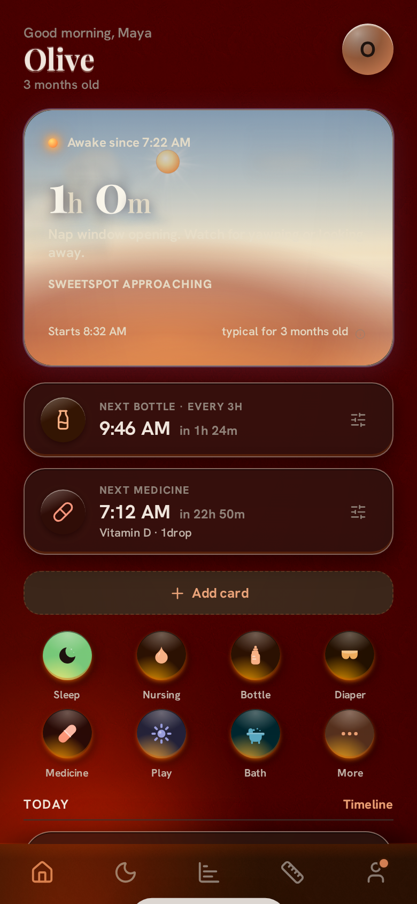
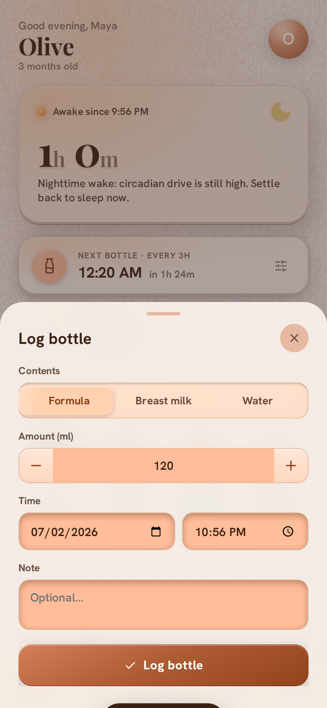
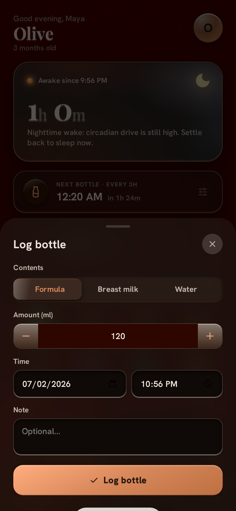

<p align="center">
  
</p>

<h1 align="center">Hearth</h1>

<p align="center"><em>A baby tracker that belongs to you.</em></p>

<p align="center">
  
  
  
  
  
</p>

Every popular baby tracker wants a subscription, an account, and a copy of your child's sleep data on someone else's servers. Hearth wants one Go binary and a SQLite file.

Track sleep, feeds, diapers, medicine, and pumping. Data lives on your devices and syncs through a server you run. Install it as a PWA and it works offline — at 3 a.m., in airplane mode, one-handed. No accounts, no ads, no analytics, no cloud.

## Screenshots

| | Light | Dark |
| --- | --- | --- |
| Hero card |  |  |
| Logging a bottle |  |  |

## What it tracks

- **Sleep** — start, end, and quality
- **Nursing** — side, duration, and time
- **Bottles** — contents and volume
- **Diapers** — wet, dirty, or mixed
- **Medicine** — custom medicines, doses, and interval reminders
- **Pumping** — side, volume, and time
- **Awake timer** — time since the last sleep, front and center
- **SweetSpot** — predicts the next ideal nap window from the baby's age
- **Sharing** — invite caregivers to log together in real time

## Run it

### Docker + Tailscale (recommended)

Tailscale is Hearth's network *and* its auth: no login page, no passwords, no port forwarding. The `docker-compose.yml` runs two containers — Tailscale joins your tailnet as the hostname `hearth`, and the app shares its network namespace, so only your devices can reach it. The app terminates TLS itself: drop a certificate pair in `certs/` (mounted read-only) and point `CERT_FILE` and `KEY_FILE` at the mounted paths.

```bash
git clone https://github.com/jeremysball/hearth.git
cd hearth

# Tailscale auth key: https://login.tailscale.com/admin/settings/keys
cp .env.example .env
# Fill in TS_AUTHKEY, CERT_FILE, and KEY_FILE

sudo docker compose up -d
```

Open `https://hearth.<your-tailnet>.ts.net:8443` and add it to your home screen.

### Bare metal

Requires Go (version in `go.mod`). The build embeds the frontend, so the binary is self-contained.

```bash
cd server
go build -o ../hearth-server .
cd ..
./hearth-server
```

`DB_PATH` defaults to `hearth.db` in the working directory. Run the binary from a stable directory, or set `DB_PATH` to an absolute path.

### systemd

```bash
sudo cp hearth-server /usr/local/bin/
sudo cp hearth.service /etc/systemd/system/
sudo systemctl enable --now hearth
```

## Configuration

Settings come from environment variables or a `.env` file in the working directory; environment variables win.

| Variable              | Default     | Description |
| --------------------- | ----------- | ----------- |
| `HOST`                | `0.0.0.0`   | Listen address |
| `PORT`                | `8443`      | Listen port |
| `CERT_FILE`           | *(empty)*   | TLS certificate path |
| `KEY_FILE`            | *(empty)*   | TLS private key path |
| `DB_PATH`             | `hearth.db` | SQLite database path |
| `STATIC_DIR`          | *(empty)*   | Serve the frontend from this directory instead of the embedded copy. Point it at the repo root during development; edits show up on refresh without a rebuild. |
| `GEOIP_ENABLED`       | `false`     | Set to `true` to enrich request logs from a local MaxMind GeoLite2 City database. |
| `GEOIP_DB_PATH`       | *(empty)*   | Path to `GeoLite2-City.mmdb`. Required when GeoIP is enabled. |
| `MAXMIND_LICENSE_KEY` | *(empty)*   | Optional. If set and `GEOIP_DB_PATH` is missing, Hearth downloads and extracts GeoLite2 City on startup. |

Set both `CERT_FILE` and `KEY_FILE` to enable TLS; leave them empty for plain HTTP. OAuth sign-in (Google and Apple) is optional; see the `PUBLIC_BASE_URL`, `GOOGLE_*`, and `APPLE_*` variables in `.env.example`.

## How it's built

No framework. No bundler. No build step for the frontend at all.

```
hearth/
├── server/            # Go backend: API, auth, SQLite, SSE sync
├── js/                # Vanilla JS frontend, no framework
├── tests/             # Playwright browser suites
├── index.html         # PWA shell
├── sw.js              # Service worker
├── styles.css         # All styles
├── icons/             # PWA icons
├── Dockerfile         # Multi-stage Go build
└── docker-compose.yml # App + Tailscale sidecar
```

The Go server owns the API, family-scoped data isolation, and real-time sync over SSE. A family is one baby, any number of caregivers, and their shared entries and settings, all keyed by `family_id`. The frontend is a vanilla JS PWA: data lives in localStorage first and syncs to the server when connected, so the app never blocks on the network. SQLite holds the shared state.

Tailscale is the auth layer. Anyone on your tailnet is trusted — the same people you'd trust with your house keys.

## Development

Run the server with `STATIC_DIR` pointed at the repo root; frontend edits show up on refresh without rebuilding:

```bash
cd server
STATIC_DIR=.. go run .
```

Without `STATIC_DIR`, the server serves the frontend baked in at the last build.

### Server logs

The server logs through Go's standard logger. Startup prints the database path, static mode, optional GeoIP database path, and listen address. Every API request logs structured fields ordered for scanning: method, status, duration, path, client IP, remote IP, host, proxy headers, user agent, caregiver ID, family ID, and any GeoIP fields. Static-file errors (4xx/5xx) are logged; successful asset fetches are silent. Status and auth events are colorized only on an interactive terminal; redirected files and systemd journals stay plain.

Auth events log as `auth event=...` with caregiver ID, family ID, and origin IP. Events include signup, invite join, launch-token login, OAuth link/restore/signup, OAuth conflict resolution, and signout. Logs never include session tokens.

GeoIP is off by default. If `GEOIP_ENABLED=true` and `GEOIP_DB_PATH` points to a missing file, startup downloads GeoLite2 City when `MAXMIND_LICENSE_KEY` is set; without a key, startup stops and tells the operator to provide one or download the database from MaxMind. Proxy location headers (Cloudflare and Vercel country/city) are logged when present, even without a local database.

### Client debug logs

The browser logs nothing by default. To enable sync and outbox tracing in DevTools:

```js
// persists across reloads until cleared
localStorage.setItem('hearth.debug', '1')
```

Or append `?debug` to the URL for one session. To turn it off:

```js
localStorage.removeItem('hearth.debug')
```

Output is namespaced and color-coded: `info` (green), `warn` (amber), `error` (red), `event` (blue).

## Testing

Each browser suite in `tests/` spawns its own server on plain HTTP — no TLS, no Tailscale — so the tests run anywhere, including CI.

```bash
npm install
npx playwright install chromium
npm test
```

The runner builds the Go binary once, then runs every suite in `tests/`, each driving Chromium through Playwright against its own server on its own port. Suites run one at a time by default; set `TEST_CONCURRENCY` to run more in parallel. Each suite reports `N pass, N fail`; any failure exits non-zero.

## License

MIT — see [LICENSE](LICENSE).
