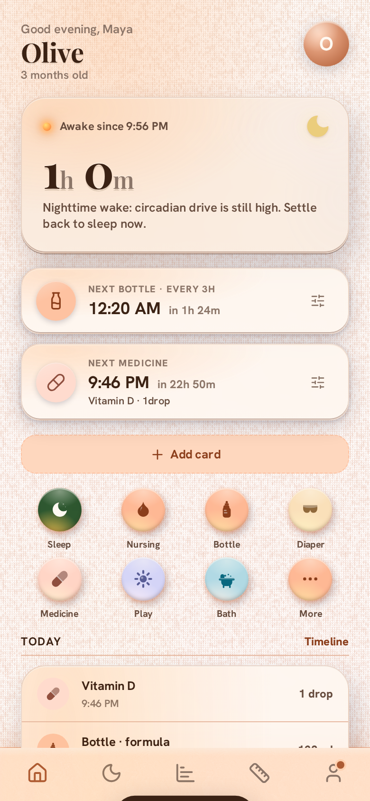
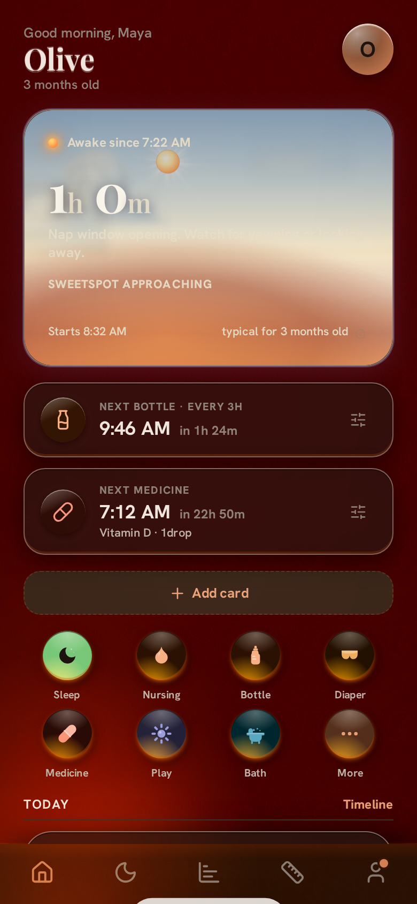
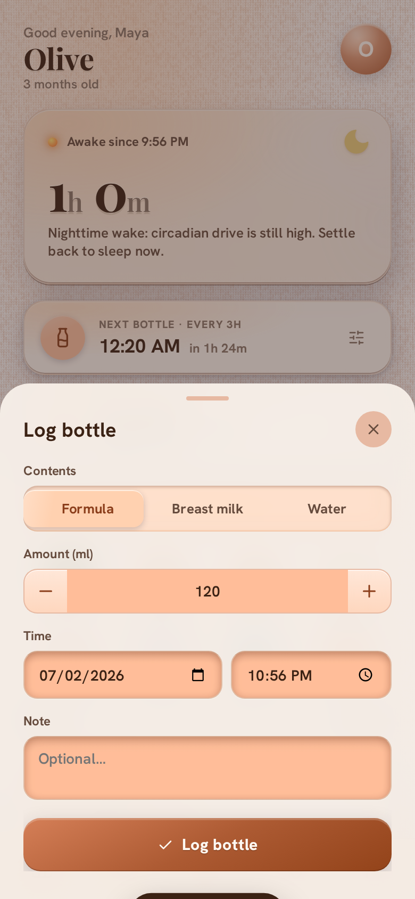
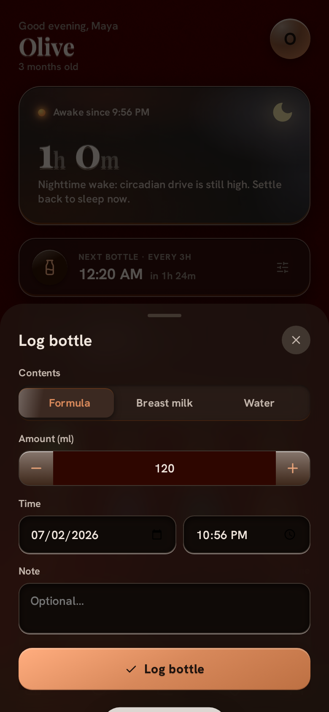

<p align="center">
  
</p>

<p align="center">
  
  
  
  
  
</p>

# Hearth

A free, private baby tracker. No ads, no lock-in, no forced account.

Track sleep, feeds, diapers, medicine, play, and bath time. Everything stays on your device: install it as a PWA and it works offline.

**[hearth website →](https://hearth.jeremyball.me/)**

## Screenshots

| | Light | Dark |
| --- | --- | --- |
| Hero card |  |  |
| Logging a bottle |  |  |

## What it tracks

- **Hero card**: awake timer with age-based nap window predictions
- **Sleep**: start, end, and quality
- **Nursing**: side, duration, and time
- **Bottles**: contents and volume
- **Diapers**: wet, dirty, or mixed
- **Medicine**: custom medicines, doses, and interval reminders
- **Play**: tummy time and floor play, logged as awake time
- **Bath**: one tap when it's done
- **Pumping**: side, volume, and time
- **SweetSpot**: predicts the next nap window from your baby's age and their own recent naps, not a fixed schedule
- **Sharing**: invite caregivers to log together in real time

## Install & Run

### Docker + Tailscale

Hearth uses Tailscale for networking and auth. The `docker-compose.yml` runs
three containers: Tailscale joins your tailnet and advertises the hostname
`hearth`, the app shares its network namespace, and Watchtower polls
[GHCR](https://ghcr.io/jeremysball/hearth) every 60s and recreates the app
container when a new `:latest` image lands. Only devices on your tailnet can
reach the app. Tailscale handles TLS.

```bash
git clone https://github.com/jeremysball/hearth.git
cd hearth

# Tailscale auth key: https://login.tailscale.com/admin/settings/keys
cp .env.example .env
# Fill in TS_AUTHKEY, CERT_FILE, and KEY_FILE

sudo docker compose pull
sudo docker compose up -d
```

The app runs at `https://hearth.<your-tailnet>.ts.net:8443`. Every merge to
`main` builds a new image and rolls the host within about a minute. The app
is briefly unreachable (~2–5s) while Watchtower recreates the container. To
roll back, pin the `app` image to a specific `:sha-<hash>` tag in
`docker-compose.yml` (find the hash in the
[GHCR package versions](https://github.com/jeremysball/hearth/pkgs/container/hearth))
and run `sudo docker compose up -d`. Watchtower ignores pinned non-`:latest`
tags.

**Why Watchtower instead of `build: .`:** `build: .` would build the image
locally on the host, from source, at `docker compose up` time. That needs the
full Go toolchain on the host, a checked-out copy of the source, and a manual
SSH-in-and-rebuild step for every update. The GHCR + Watchtower pattern moves
the build off the host entirely: `.github/workflows/build.yml` builds and
publishes the image once, centrally, in CI's clean environment, on every merge
to `main`. The host then only ever pulls a finished image and never builds
anything, so a deploy is "merge to `main`," not "SSH in and rebuild." This is
also why rollback works by pinning a `:sha-<hash>` tag rather than reverting
source and rebuilding: the old image already exists in GHCR.

### Without Docker

Requires Go (version in `go.mod`) and Node 22+. The frontend is bundled by Vite into `dist/`, then embedded into the binary at build time, so the resulting binary is self-contained.

```bash
# one-time
npm install

# rebuild the frontend bundle and embed it into the Go binary
npm run build            # vite build + scripts/patch-sw.mjs
go build -o hearth-server ./cmd/hearth
./hearth-server
```

`DB_PATH` defaults to a `hearth.db` relative to where you run the binary. Pick a stable working directory, or set `DB_PATH` to an absolute path.

Confirm it's up: `curl -fsS http://127.0.0.1:8443/` (once `PEPPER` and the VAPID keys below are set — otherwise the binary exits before binding).

### Token pepper (required)

Every deploy must set `PEPPER`, a comma-separated list of secrets (current pepper first, older ones after) used to HMAC-hash session cookies, invite links, launch tokens, and pending-auth tokens before they touch the database. Each entry must be at least 32 bytes. The server refuses to start without it.

```bash
openssl rand -hex 32   # generates a 64-char hex string, well over the 32-byte minimum
```

**This is a breaking change for existing deployments**: upgrading to a version with `PEPPER` required, without setting it first, means the server fails to start. Set `PEPPER` in your secrets manager or `.env` before pulling the new image.

To rotate a pepper without logging everyone out immediately: prepend the new pepper, keep the old one as a fallback, deploy, wait until no pre-rotation session is expected to remain (the session cookie's 10-year TTL means this is an operator judgment call — weeks is reasonable for a small family), then drop the old pepper.

**Rollback:** the migration is forward-only — a previous binary's `SELECT ... WHERE token = ?` breaks against the renamed `token_hash` column. Take a SQLite backup before every deploy (`sqlite3 hearth.db ".backup hearth.pre-migration.db"`); to roll back, stop the new binary, restore that backup over `hearth.db`, and start the previous binary. There's no in-place rollback path.

### VAPID keys (required)

The server refuses to start without a VAPID keypair for web push. Generate one and set all three values in `.env` before first launch, in both the Docker and non-Docker paths:

```bash
go run ./cmd/vapidgen
```

This prints `VAPID_PUBLIC_KEY` and `VAPID_PRIVATE_KEY`. Set both in `.env`, along with `VAPID_SUBJECT`: a real `mailto:` address or URL you control, since push services may contact it if your server misbehaves.

### systemd

```bash
sudo useradd --system --home-dir /opt/hearth --shell /usr/sbin/nologin hearth 2>/dev/null
sudo mkdir -p /opt/hearth
sudo cp hearth-server /usr/local/bin/
sudo cp .env /opt/hearth/.env
sudo chown -R hearth:hearth /opt/hearth
sudo cp systemd/hearth.service /etc/systemd/system/
sudo systemctl daemon-reload
sudo systemctl enable --now hearth
```

`hearth.service` runs the binary as the `hearth` user with `WorkingDirectory=/opt/hearth`, so `DB_PATH`'s default (`hearth.db`, relative) resolves to `/opt/hearth/hearth.db`. Use an absolute `DB_PATH` in `.env` instead if you want the database somewhere else.

## Configuration

Settings come from environment variables or a `.env` file in the working directory:

| Variable              | Default     | Description |
| --------------------- | ----------- | ----------- |
| `HOST`                | `0.0.0.0`   | Listen address. `0.0.0.0` binds every interface the host has, not just your tailnet — if the host also has a LAN/Wi-Fi interface, anything on that network can reach Hearth too. Set this to your Tailscale IP (`tailscale ip -4`) instead to scope it to tailnet-only. |
| `PORT`                | `8443`      | Listen port |
| `CERT_FILE`           | *(empty)*   | TLS certificate path |
| `KEY_FILE`            | *(empty)*   | TLS private key path |
| `DB_PATH`             | `hearth.db` | SQLite database path |
| `STATIC_DIR`          | *(empty)*   | Empty: serve the frontend embedded in the binary. Set to `.`: serve files live from disk, so edits show up on refresh without a Go rebuild. |
| `DEV_MODE`            | `false`     | Never set this in production. Skips the 10-tap secret and auto-enables developer mode on every device that boots against this server, plus adds a "Skip with demo data" button to onboarding. See below. |
| `GEOIP_ENABLED`       | `false`     | Set to `true` to enrich request logs from a local MaxMind GeoLite2 City database. |
| `GEOIP_DB_PATH`       | *(empty)*   | Path to `GeoLite2-City.mmdb`. Required when GeoIP is enabled. |
| `MAXMIND_LICENSE_KEY` | *(empty)*   | Optional. If set and `GEOIP_DB_PATH` is missing, Hearth downloads and extracts GeoLite2 City on startup. |

Set both `CERT_FILE` and `KEY_FILE` to enable TLS; leave them empty for plain HTTP.

### Developer mode

Normally, developer mode (a hidden "Test push in 15s" button in Profile) unlocks by tapping the version stamp at the bottom of the Profile tab 10 times within 2 seconds of each tap. That's meant for a real device where you don't want a stray tap turning it on by accident.

For a throwaway dev/test deployment, set `DEV_MODE=true` instead: every device that boots against that server gets developer mode automatically, no tapping required. If the instance has no family yet, onboarding gets an extra "Skip with demo data" button that fills in placeholder values and jumps straight to the home screen. If a family already exists (e.g. a dev instance seeded from a copy of real data), the "This Hearth already has a family" screen instead gets a "Join as dev caregiver" button that joins it with no invite link or OAuth sign-in required. Never set `DEV_MODE=true` on a deployment real caregivers use.

### Recovering a locked-out caregiver

Normally you invite a caregiver from inside the app (Profile → Invite). If someone is locked out (e.g. removed from a family and never linked an OAuth provider before that), they have no session to invite anyone from. With shell access to the server, mint an invite directly against the database instead:

```bash
hearth invite list             # family_id, baby name, active caregiver count, entry count
hearth invite create <family_id>
```

`hearth invite create` prints a one-time `/join/<token>` link (48h expiry) that anyone can open to rejoin that family as a new caregiver. Uses the same `DB_PATH`/`PUBLIC_BASE_URL` env vars as the server; run it on the same host/config, without starting the HTTP listener.

## Architecture

```
hearth/
├── cmd/
│   ├── hearth/        # Server entrypoint (thin main, imports server/)
│   └── vapidgen/      # One-off VAPID keypair generator
├── server/            # Go backend package: API, auth, SQLite, SSE sync
├── js/                # Vanilla JS frontend source (no framework)
├── public/            # Vite publicDir: pass-through (icons/, assets/, manifest.webmanifest)
├── index.html         # Vite entry — references ./styles.css + ./js/app.js
├── sw.js              # Hand-written service worker (post-build patched)
├── styles.css         # All styles (Vite processes → dist/static/*.css)
├── vite.config.js     # Vite config: `root: '.'`, `outDir: 'dist'`, `assetsDir: 'static'`
├── scripts/
│   ├── bump-version.sh    # Cache-buster bump (sw.js VERSION + index.html <meta>)
│   └── patch-sw.mjs       # Post-build: rewrites sw.js SHELL against Vite manifest
├── dist/              # Vite build output (gitignored except .gitkeep placeholder)
├── assets.go          # `package hearth` — //go:embed all:dist + fs.Sub
├── Dockerfile         # Multi-stage: npm build → go build
└── docker-compose.yml # App + Tailscale sidecar
```

The Go server owns the API, family-scoped data isolation, and real-time sync over SSE. One family means one baby, any number of caregivers, and shared entries and settings, all keyed by `family_id`. The frontend is a vanilla JS PWA bundled by Vite: data lives in localStorage and syncs to the server when connected. SQLite holds the shared state.

Vite emits content-hashed JS/CSS at `dist/static/<chunk>-<hash>.{js,css}`. The server sends `Cache-Control: public, max-age=31536000, immutable` for those URLs (and only those — unhashed `assets/`, `icons/`, `manifest.webmanifest`, `sw.js`, `index.html` keep their existing no-store / heuristic behaviour). See `docs/codebase-quickref.md` for the full layout and `server/router.go`'s `cacheControl` for the exact policy.

Tailscale is the auth layer for the default Docker Compose setup: no login page, no passwords, anyone on your tailnet is trusted. If you expose Hearth to the public internet instead (for example, to reach Google OAuth), every session cookie, invite link, and launch token is a bearer credential that a leaked database backup would otherwise expose in the clear. All four token tables store an HMAC-SHA256 hash of the token, keyed by a server-side pepper, instead of the raw value — see `PEPPER` below.

## Development

Two processes run side by side: the Go backend (port 8443 by default) and the Vite dev server (port 5173, HMR). Vite serves the rebuilt frontend at http://localhost:5173/ and proxies `/api/*`, `/join/*`, `/auth/*`, and `/sw.js` to Go.

```bash
# terminal 1 — Go server, sources `STATIC_DIR` (see `static/` flag below)
# so sw.js changes show up on reload without rebuilding Go.
STATIC_DIR=. go run ./cmd/hearth

# terminal 2 — Vite dev server. Edit js/* and reload, no rebuild needed.
npm run dev
# (set HMR_BACKEND=http://localhost:9000 to talk to a different Go port)

# For a production-like local server (the embedded binary serves the
# built dist/), build then run without STATIC_DIR:
npm run build
go run ./cmd/hearth
```

`STATIC_DIR=.` makes Go serve files live from the source tree (`index.html`, `sw.js`, `icons/`, etc.) instead of the embedded `dist/`. Hearth's pre-Vite workflow relied on this — it still works, but only for files Vite doesn't transform (everything in `public/`, `sw.js` itself, the source `index.html`). To exercise the actual Vite-bundled app, run `npm run build` then drop `STATIC_DIR`.

### Server logs

The server logs through Go's standard logger. On startup: db path, static mode, optional GeoIP database path, and address. Every API request logs structured fields ordered for scanning: method, status, duration, path, client IP, remote IP, host, proxy headers, user agent, caregiver ID, family ID, and available GeoIP fields. Static file errors (4xx/5xx) are logged; successful asset fetches are silent. Status and auth events are colorized only when the log stream is an interactive terminal; redirected files and systemd logs stay plain text.

Auth events log as `auth event=...` with caregiver ID, family ID, and origin IP. Events include signup, invite join, launch-token login, OAuth link/restore/signup, OAuth conflict resolution, and signout. Logs never include session tokens.

GeoIP is off by default. If `GEOIP_ENABLED=true` and `GEOIP_DB_PATH` points to a missing file, startup downloads GeoLite2 City when `MAXMIND_LICENSE_KEY` is set. Without a license key, startup stops with a message telling the operator to download the database from MaxMind or provide the key. Proxy-provided location headers, such as Cloudflare or Vercel country/city headers, are logged when present even without the local database.

### Client debug logs

The browser logs nothing by default. To enable sync and outbox tracing in DevTools:

```js
// persists across reloads until cleared
localStorage.setItem('hearth.debug', '1')
```

Or append `?debug` to the URL for one session. To turn it off:

```js
localStorage.removeItem('hearth.debug')
```

Output is namespaced and colour-coded: `info` (green), `warn` (amber), `error` (red), `event` (blue).

## Testing

Browser tests in `tests/` run against a self-spawned server on plain HTTP, with no TLS and no Tailscale, so they work in CI.

```bash
npm install
npx playwright install chromium
npm test
```

The runner builds the Go binary if needed, starts the server on `127.0.0.1:18787`, drives Chromium via Playwright, and tears down on exit. Each suite reports `N pass, N fail`; any failure exits non-zero.

## License

MIT. See [LICENSE](LICENSE).
